# FutureForge AI - Architecture Diagrams

## Document Information
- **Version:** 1.0
- **Date:** February 14, 2026
- **Project:** FutureForge AI - System Architecture
- **Target:** Amazon AI for Bharat Hackathon
- **Cloud Provider:** AWS (Asia Pacific - Mumbai Region)

---

## Table of Contents

1. [High-Level System Architecture](#1-high-level-system-architecture)
2. [AWS Cloud Infrastructure](#2-aws-cloud-infrastructure)
3. [AI/ML Pipeline Architecture](#3-aiml-pipeline-architecture)
4. [Resume Intelligence Pipeline](#4-resume-intelligence-pipeline)
5. [Burnout Detection & Recovery Flow](#5-burnout-detection--recovery-flow)
6. [Data Flow Diagrams](#6-data-flow-diagrams)
7. [Component Interaction Diagrams](#7-component-interaction-diagrams)
8. [Deployment Architecture](#8-deployment-architecture)

---

## 1. High-Level System Architecture

### 1.1 Three-Layer Architecture

**Requirements Mapping:**
- Client Layer: REQ-NFR-032 (Responsive design)
- API Gateway: REQ-NFR-003, REQ-NFR-021 (Rate limiting)
- Auth: REQ-NFR-019, REQ-NFR-020 (Authentication)
- Engines: REQ-SIM-006, REQ-RES-003, REQ-PLAN-001, REQ-BURN-016, REQ-PROG-001
- Data Layer: REQ-INT-010, REQ-NFR-017 (Encryption)

---

## 2. AWS Cloud Infrastructure

### 2.1 Complete AWS Architecture

**Requirements Mapping:**
- CloudFront: REQ-NFR-045, REQ-NFR-046 (Low bandwidth)
- API Gateway: REQ-NFR-003, REQ-NFR-021 (Performance, Rate limiting)
- Cognito: REQ-NFR-019, REQ-NFR-020 (Auth, Password policy)
- Lambda: REQ-NFR-001, REQ-NFR-002 (Performance)
- Bedrock: REQ-SIM-006, REQ-RES-003 (AI generation)
- DynamoDB: REQ-INT-010, REQ-NFR-013 (Data persistence, Backup)
- S3: REQ-SIM-001, REQ-NFR-017 (Resume storage, Encryption)
- EventBridge: REQ-INT-009, REQ-NFR-014 (Event flow, Reliability)

---

## 3. AI/ML Pipeline Architecture

### 3.1 AI Model Integration Flow

**Requirements Mapping:**
- Model Router: REQ-NFR-015 (Graceful degradation)
- Cache: REQ-NFR-001, REQ-NFR-002 (Performance)
- Bedrock Models: REQ-SIM-006, REQ-RES-003, REQ-PLAN-001
- SageMaker Models: REQ-BURN-016, REQ-PROG-001
- Validator: REQ-NFR-055, REQ-NFR-058 (Data quality)

---

## 4. Resume Intelligence Pipeline

### 4.1 Resume Processing Data Flow

### 4.2 Resume Analysis Detailed Flow

**Requirements Mapping:**
- Upload: REQ-SIM-001, REQ-RES-001
- Parsing: REQ-RES-001, REQ-RES-002
- ATS Check: REQ-RES-005, REQ-RES-006, REQ-RES-007, REQ-RES-008
- Content Analysis: REQ-RES-009, REQ-RES-010, REQ-RES-011, REQ-RES-012
- Role Alignment: REQ-RES-014, REQ-RES-015, REQ-RES-016, REQ-RES-017
- Scoring: REQ-RES-003, REQ-RES-004
- Impact: REQ-RES-018, REQ-RES-019, REQ-RES-021

---

## 5. Burnout Detection & Recovery Flow

### 5.1 Low Mood Trigger to Plan Rebalancing

**Requirements Mapping:**
- Mood Logging: REQ-BURN-006, REQ-BURN-007, REQ-BURN-008
- Consecutive Check: REQ-BURN-009
- Risk Calculation: REQ-BURN-016, REQ-BURN-017
- Recovery Activation: REQ-BURN-011, REQ-BURN-012, REQ-BURN-013
- Timeline Extension: REQ-BURN-015
- Exit Criteria: REQ-BURN-014
- Integration: REQ-INT-003

### 5.2 Burnout Risk Calculation Flow

**Requirements Mapping:**
- Study Hours: REQ-BURN-001, REQ-BURN-002, REQ-BURN-003
- Completion: REQ-BURN-004
- Mood: REQ-BURN-006, REQ-BURN-007, REQ-BURN-008, REQ-BURN-009
- Risk Calculation: REQ-BURN-016
- Threshold: REQ-BURN-017
- Actions: REQ-BURN-011, REQ-BURN-018

---

## 6. Data Flow Diagrams

### 6.1 Career Trajectory Generation Flow

**Requirements Mapping:**
- Input: REQ-SIM-001, REQ-SIM-002, REQ-SIM-003
- Validation: REQ-SIM-004
- Skill Gap: REQ-SIM-011, REQ-SIM-012, REQ-SIM-013
- Generation: REQ-SIM-006, REQ-SIM-007, REQ-SIM-008
- Risk: REQ-SIM-016, REQ-SIM-017, REQ-SIM-018
- Feasibility: REQ-SIM-019
- Confidence: REQ-SIM-010

### 6.2 Study Plan Generation & Adaptation Flow

**Requirements Mapping:**
- Generation: REQ-PLAN-001, REQ-PLAN-002, REQ-PLAN-003, REQ-PLAN-004
- Constraints: REQ-PLAN-005, REQ-PLAN-006
- Resources: REQ-PLAN-007, REQ-PLAN-008, REQ-PLAN-009
- Tracking: REQ-PLAN-012
- Rebalancing: REQ-PLAN-013, REQ-PLAN-015, REQ-PLAN-016
- Context: REQ-PLAN-014, REQ-PLAN-019
- Integration: REQ-INT-002, REQ-INT-003

---

## 7. Component Interaction Diagrams

### 7.1 Cross-Module Integration Flow

```mermaid
sequenceDiagram
    participant User
    participant Resume as Resume Engine
    participant Career as Career Engine
    participant Planner as Planner Engine
    participant Burnout as Burnout Engine
    participant Progress as Progress Engine
    participant Events as EventBridge
    participant DDB as DynamoDB
    
    Note over User,DDB: REQ-INT-001: Resume → Career Integration
    
    User->>Resume: Upload Resume
    Resume->>Resume: Analyze Resume
    Resume->>DDB: Save Analysis
    Resume->>Events: Publish "Resume Analyzed"
    
    Events->>Career: Trigger Simulation
    Career->>DDB: Get Resume Data
    Career->>Career: Generate Trajectory<br/>Using Resume Skills
    Career->>DDB: Save Trajectory
    Career->>Events: Publish "Trajectory Generated"
    
    Note over Events,Planner: REQ-INT-002: Career → Planner Integration
    
    Events->>Planner: Trigger Plan Generation
    Planner->>DDB: Get Skill Gaps
    Planner->>Planner: Generate Study Plan<br/>Based on Gaps
    Planner->>DDB: Save Plan
    Planner->>Events: Publish "Plan Generated"
    
    Note over User,Progress: User Executes Plan
    
    User->>Planner: Complete Task
    Planner->>DDB: Update Task Status
    Planner->>Progress: Update Metrics
    Progress->>Progress: Calculate Velocity
    Progress->>DDB: Save Progress
    
    Note over User,Burnout: REQ-INT-003: Burnout → Planner Integration
    
    User->>Burnout: Log Low Mood
    Burnout->>Burnout: Calculate Risk
    
    alt Risk > 70%
        Burnout->>Events: Publish "Burnout Alert"
        Events->>Planner: Trigger Rebalance
        Planner->>DDB: Get Current Plan
        Planner->>Planner: Reduce Intensity 50%
        Planner->>DDB: Save Updated Plan
        Planner->>User: Notify Plan Changed
    end
    
    Note over User,Career: REQ-INT-004: Resume Update → Trajectory Recalc
    
    User->>Resume: Update Resume
    Resume->>Resume: Re-analyze
    Resume->>DDB: Save New Version
    Resume->>Events: Publish "Resume Updated"
    
    Events->>Career: Trigger Recalculation
    Career->>DDB: Get Updated Resume
    Career->>Career: Regenerate Trajectory
    Career->>DDB: Save New Trajectory
    Career->>User: Notify Trajectory Updated
    
    Note over User: REQ-INT-009: Event Processing < 5s
```

**Requirements Mapping:**
- Resume → Career: REQ-INT-001
- Career → Planner: REQ-INT-002
- Burnout → Planner: REQ-INT-003
- Resume Update: REQ-INT-004
- Event Processing: REQ-INT-009

### 7.2 Feedback Loop Architecture

**Requirements Mapping:**
- Daily Loop: REQ-INT-006
- Weekly Loop: REQ-INT-007
- Monthly Loop: REQ-INT-008
- Real-Time: REQ-INT-003, REQ-BURN-016

---

## 8. Deployment Architecture

### 8.1 Multi-Environment Deployment

**Requirements Mapping:**
- Multi-Environment: REQ-NFR-051
- Auto-scaling: REQ-NFR-007, REQ-NFR-008
- Backup: REQ-NFR-013
- Monitoring: REQ-NFR-014, REQ-NFR-048, REQ-NFR-049
- Disaster Recovery: RTO 4 hours, RPO 1 hour

### 8.2 Security Architecture

**Requirements Mapping:**
- WAF: REQ-NFR-022
- Authentication: REQ-NFR-019, REQ-NFR-020
- Rate Limiting: REQ-NFR-021
- Encryption at Rest: REQ-NFR-017
- Encryption in Transit: REQ-NFR-018
- IAM: REQ-NFR-023
- Audit Logs: REQ-NFR-024
- Input Validation: REQ-NFR-053

---

## 9. Performance & Scalability Architecture

### 9.1 Caching Strategy

**Requirements Mapping:**
- CDN: REQ-NFR-045, REQ-NFR-046
- Redis: REQ-NFR-003, REQ-NFR-005
- Cache Strategy: REQ-NFR-010

### 9.2 Auto-Scaling Configuration

**Requirements Mapping:**
- Lambda Scaling: REQ-NFR-007, REQ-NFR-008
- DynamoDB Scaling: REQ-NFR-009
- Performance: REQ-NFR-001, REQ-NFR-002, REQ-NFR-003

---

## 10. Data Model Architecture

### 10.1 DynamoDB Single-Table Design

**Requirements Mapping:**
- Single Table: REQ-INT-010
- Access Patterns: REQ-NFR-009
- TTL: Auto-expire old data

### 10.2 Event-Driven Architecture

**Requirements Mapping:**
- Event Bus: REQ-INT-009
- Async Processing: REQ-NFR-011
- DLQ: REQ-NFR-014
- Retry: 3 attempts, 2hr max age

---

## 11. Requirements Traceability Matrix

### 11.1 Architecture Component to Requirements Mapping

| Component | Requirements | Diagram Reference |
|-----------|-------------|-------------------|
| **API Gateway** | REQ-NFR-003, REQ-NFR-021 | Section 2.1 |
| **Cognito** | REQ-NFR-019, REQ-NFR-020 | Section 2.1, 8.2 |
| **Lambda Functions** | REQ-NFR-001, REQ-NFR-002, REQ-NFR-006 | Section 2.1 |
| **Bedrock** | REQ-SIM-006, REQ-RES-003, REQ-PLAN-001 | Section 3.1 |
| **SageMaker** | REQ-BURN-016, REQ-PROG-001 | Section 3.1 |
| **Comprehend** | REQ-BURN-007, REQ-BURN-008 | Section 3.1 |
| **Textract** | REQ-RES-001, REQ-SIM-001 | Section 4.1 |
| **DynamoDB** | REQ-INT-010, REQ-NFR-013, REQ-NFR-017 | Section 2.1, 10.1 |
| **S3** | REQ-SIM-001, REQ-NFR-017 | Section 2.1 |
| **ElastiCache** | REQ-NFR-003, REQ-NFR-010 | Section 9.1 |
| **OpenSearch** | REQ-RES-015, REQ-SIM-009 | Section 2.1 |
| **EventBridge** | REQ-INT-009, REQ-NFR-014 | Section 2.1, 10.2 |
| **Step Functions** | REQ-INT-004 | Section 2.1 |
| **CloudWatch** | REQ-NFR-048, REQ-NFR-049 | Section 2.1 |
| **X-Ray** | REQ-NFR-049 | Section 2.1 |
| **WAF** | REQ-NFR-022 | Section 8.2 |
| **KMS** | REQ-NFR-017, REQ-NFR-018 | Section 8.2 |

### 11.2 Flow to Requirements Mapping

| Flow | Requirements | Diagram Reference |
|------|-------------|-------------------|
| **Resume Upload** | REQ-SIM-001, REQ-RES-001 | Section 4.2 |
| **Resume Analysis** | REQ-RES-002 to REQ-RES-021 | Section 4.1, 4.2 |
| **Career Simulation** | REQ-SIM-006 to REQ-SIM-023 | Section 6.1 |
| **Study Plan Generation** | REQ-PLAN-001 to REQ-PLAN-023 | Section 6.2 |
| **Burnout Detection** | REQ-BURN-001 to REQ-BURN-023 | Section 5.1, 5.2 |
| **Plan Rebalancing** | REQ-PLAN-013, REQ-INT-003 | Section 5.1 |
| **Progress Tracking** | REQ-PROG-001 to REQ-PROG-025 | Section 7.1 |
| **Cross-Module Integration** | REQ-INT-001 to REQ-INT-009 | Section 7.1 |

---

## 12. Architecture Decision Records (ADRs)

### ADR-001: Serverless Architecture

**Decision:** Use AWS Lambda for all compute workloads

**Rationale:**
- Zero infrastructure management
- Pay-per-use pricing (cost-efficient for hackathon)
- Automatic scaling (REQ-NFR-007, REQ-NFR-008)
- Fast deployment and iteration

**Consequences:**
- Cold start latency (mitigated with provisioned concurrency)
- 15-minute execution limit (acceptable for our use case)
- Vendor lock-in to AWS

### ADR-002: Single-Table DynamoDB Design

**Decision:** Use single-table design for DynamoDB

**Rationale:**
- Efficient access patterns
- Lower cost (fewer tables)
- Better performance (fewer network calls)
- Follows AWS best practices

**Consequences:**
- More complex data modeling
- Requires careful GSI design
- Harder to understand for new developers

### ADR-003: Amazon Bedrock for AI

**Decision:** Use Amazon Bedrock instead of self-hosted models

**Rationale:**
- No model management overhead
- Multiple model options (Claude, Titan)
- Pay-per-token pricing
- Built-in safety features

**Consequences:**
- Higher per-request cost than self-hosted
- Limited customization
- Dependent on AWS model availability

### ADR-004: Event-Driven Architecture

**Decision:** Use EventBridge for inter-service communication

**Rationale:**
- Loose coupling between services (REQ-NFR-051)
- Async processing for heavy workloads
- Built-in retry and DLQ (REQ-NFR-014)
- Easy to add new consumers

**Consequences:**
- Eventual consistency
- More complex debugging
- Additional latency for async operations

---

## Appendix: Diagram Legend

### Color Coding

- 🔵 **Blue (#0066FF):** Core business logic components
- 🔴 **Red (#FF5252):** Burnout/Alert related components
- 🟢 **Green (#00C853):** Success/Progress related components
- 🟠 **Orange (#FFA726):** Processing/Transformation components
- 🟣 **Purple (#9C27B0):** Output/Result components
- ⚪ **Gray (#E3F2FD):** Input/User components

### Arrow Types

- **Solid Arrow (→):** Synchronous call
- **Dashed Arrow (-.->):** Asynchronous call
- **Thick Arrow (==>):** Data flow
- **Dotted Arrow (...>):** Optional/Conditional flow

---

**Document Version:** 1.0  
**Last Updated:** February 14, 2026  
**Status:** Complete  
**Target:** Amazon AI for Bharat Hackathon

*End of Architecture Diagrams Document*
