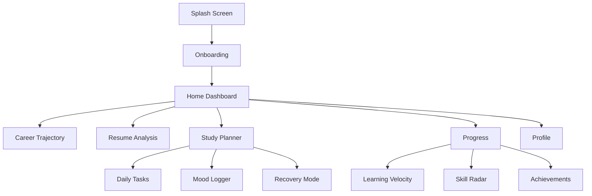

# FutureForge AI - Mobile App Wireframes Preview

## Document Information
- **Version:** 1.0
- **Date:** February 14, 2026
- **Platform:** Mobile (iOS & Android)
- **Target:** Amazon AI for Bharat Hackathon
- **Screen Size:** 375×667 (iPhone SE) to 428×926 (iPhone 14 Pro Max)

---

## Design Philosophy

### Mobile-First Approach
- **Touch-Optimized:** Minimum 44×44pt tap targets
- **Thumb-Friendly:** Key actions within thumb reach
- **Gesture-Based:** Swipe, pull-to-refresh, long-press
- **Progressive Disclosure:** Show essential info first, details on demand

### Visual Hierarchy
- **Card-Based Layout:** Scannable content blocks
- **Bottom Navigation:** Easy one-handed access
- **Floating Action Button:** Primary actions always accessible
- **Collapsible Sections:** Reduce scroll fatigue

---

## Navigation Structure



---

## Screen 1: Splash & Onboarding

### 1.1 Splash Screen

```
┌─────────────────────┐
│                     │
│                     │
│                     │
│       🚀            │
│   FutureForge       │
│       AI            │
│                     │
│  Your Career OS     │
│                     │
│                     │
│    Loading...       │
│                     │
└─────────────────────┘
```

### 1.2 Onboarding Carousel

```
┌─────────────────────┐
│  ← 1/3 →            │
├─────────────────────┤
│                     │
│       📈            │
│                     │
│  Predict Your       │
│  Career Path        │
│                     │
│  See your 5-year    │
│  trajectory with    │
│  AI-powered         │
│  insights           │
│                     │
│  ○ ● ○              │
│                     │
│  [Skip]   [Next]    │
└─────────────────────┘
```

### 1.3 Resume Upload (Mobile)

```
┌─────────────────────┐
│  ← Upload Resume    │
├─────────────────────┤
│                     │
│  Step 2 of 3        │
│  ████████░░░░       │
│                     │
│  ┌───────────────┐  │
│  │               │  │
│  │   📄 Tap to   │  │
│  │     Upload    │  │
│  │               │  │
│  │  PDF, DOCX    │  │
│  │  Max 5MB      │  │
│  │               │  │
│  └───────────────┘  │
│                     │
│  Or take a photo    │
│  [📷 Camera]        │
│                     │
│                     │
│  [Back]    [Next]   │
└─────────────────────┘
```

---

## Screen 2: Home Dashboard (Mobile)

### 2.1 Dashboard Overview

```
┌─────────────────────┐
│  ☰  FutureForge  🔔 │
├─────────────────────┤
│                     │
│  Hi, Rahul! 👋      │
│  21-day streak 🔥   │
│                     │
│  ┌───────────────┐  │
│  │ Quick Stats   │  │
│  ├───────────────┤  │
│  │ Success: 67%  │  │
│  │ Burnout: 28%  │  │
│  │ Tasks: 12/15  │  │
│  └───────────────┘  │
│                     │
│  ┌───────────────┐  │
│  │ 📊 Career     │  │
│  │ Trajectory    │  │
│  │ 45% → 80%     │  │
│  │ [View More]   │  │
│  └───────────────┘  │
│                     │
│  ┌───────────────┐  │
│  │ 📄 Resume     │  │
│  │ Score: 72/100 │  │
│  │ [Improve]     │  │
│  └───────────────┘  │
│                     │
│  ┌───────────────┐  │
│  │ 📅 Today      │  │
│  │ 3 tasks left  │  │
│  │ [Start]       │  │
│  └───────────────┘  │
│                     │
├─────────────────────┤
│ 🏠 📊 📄 📅 👤     │
└─────────────────────┘
```


### 2.2 Bottom Navigation

| Icon | Label | Function |
|------|-------|----------|
| 🏠 | Home | Dashboard overview |
| 📊 | Career | Trajectory & skills |
| 📄 | Resume | Analysis & tips |
| 📅 | Planner | Daily tasks & schedule |
| 👤 | Profile | Settings & account |

---

## Screen 3: Career Trajectory (Mobile)

### 3.1 Trajectory Chart (Mobile-Optimized)

```
┌─────────────────────┐
│  ← Career Path      │
├─────────────────────┤
│                     │
│  Your 5-Year Path   │
│                     │
│  ● Best  ○ Avg  ○ Worst
│                     │
│  Success %          │
│  95┤         ●      │
│  85┤      ●         │
│  75┤   ●            │
│  65┤●               │
│  55┤                │
│    └─────────────   │
│    Y1  Y2  Y3  Y4  Y5
│                     │
│  Current: 65%       │
│  Target: 95%        │
│  Confidence: ±10%   │
│                     │
│  [View Details]     │
│                     │
│  ▼ Scroll for more  │
│                     │
└─────────────────────┘
```

### 3.2 Skill Gaps (Mobile Cards)

```
┌─────────────────────┐
│  ← Skill Gaps       │
├─────────────────────┤
│                     │
│  ┌───────────────┐  │
│  │ 🔴 CORE       │  │
│  ├───────────────┤  │
│  │ System Design │  │
│  │ Impact: 95/100│  │
│  │ ████████████░ │  │
│  │ +25% success  │  │
│  │ 120 hrs       │  │
│  │ [Learn Now]   │  │
│  └───────────────┘  │
│                     │
│  ┌───────────────┐  │
│  │ 🔴 CORE       │  │
│  ├───────────────┤  │
│  │ DSA           │  │
│  │ Impact: 92/100│  │
│  │ ████████████░ │  │
│  │ +30% success  │  │
│  │ 150 hrs       │  │
│  │ [Learn Now]   │  │
│  └───────────────┘  │
│                     │
│  ┌───────────────┐  │
│  │ 🟡 IMPORTANT  │  │
│  ├───────────────┤  │
│  │ AWS/Cloud     │  │
│  │ Impact: 78/100│  │
│  │ ████████░░░░  │  │
│  │ +15% offers   │  │
│  │ 80 hrs        │  │
│  │ [Learn Now]   │  │
│  └───────────────┘  │
│                     │
└─────────────────────┘
```

### 3.3 Path Comparison (Swipeable Cards)

```
┌─────────────────────┐
│  ← Compare Paths    │
├─────────────────────┤
│                     │
│  Swipe to compare → │
│                     │
│  ┌───────────────┐  │
│  │ With 2        │  │
│  │ Internships   │  │
│  ├───────────────┤  │
│  │               │  │
│  │   85%         │  │
│  │ Placement     │  │
│  │               │  │
│  │ ✓ Sys Design  │  │
│  │ ✓ Cloud       │  │
│  │ ✓ Microserv   │  │
│  │               │  │
│  │ Timeline: 2yr │  │
│  │ Effort: High  │  │
│  │               │  │
│  │ [Select Path] │  │
│  └───────────────┘  │
│                     │
│  ○ ● ○              │
│                     │
└─────────────────────┘
```

---

## Screen 4: Resume Analysis (Mobile)

### 4.1 Resume Score

```
┌─────────────────────┐
│  ← Resume Analysis  │
├─────────────────────┤
│                     │
│      ┌─────┐        │
│      │ 72  │        │
│      │/100 │        │
│      └─────┘        │
│                     │
│  ⚠️ Needs Work      │
│                     │
│  ┌───────────────┐  │
│  │ ATS: 65/100   │  │
│  │ ⚠️ 4 issues    │  │
│  └───────────────┘  │
│                     │
│  ┌───────────────┐  │
│  │ Content: 75   │  │
│  │ ✓ Good        │  │
│  └───────────────┘  │
│                     │
│  ┌───────────────┐  │
│  │ Alignment: 76 │  │
│  │ ✓ Good        │  │
│  └───────────────┘  │
│                     │
│  [View Full Report] │
│                     │
│  Analyzed: 2m ago   │
│                     │
└─────────────────────┘
```

### 4.2 Weak Bullets (Expandable List)

```
┌─────────────────────┐
│  ← Weak Bullets     │
├─────────────────────┤
│                     │
│  ┌───────────────┐  │
│  │ Line 12       │  │
│  │ Score: 35/100 │  │
│  ├───────────────┤  │
│  │ "Worked on    │  │
│  │  project"     │  │
│  │               │  │
│  │ Issues:       │  │
│  │ • No action   │  │
│  │ • No metrics  │  │
│  │ • Vague       │  │
│  │               │  │
│  │ Impact:       │  │
│  │ +10% callbacks│  │
│  │               │  │
│  │ [Fix It]      │  │
│  └───────────────┘  │
│                     │
│  ┌───────────────┐  │
│  │ Line 15       │  │
│  │ Score: 42/100 │  │
│  │ [Expand]      │  │
│  └───────────────┘  │
│                     │
│  ┌───────────────┐  │
│  │ Line 18       │  │
│  │ Score: 38/100 │  │
│  │ [Expand]      │  │
│  └───────────────┘  │
│                     │
└─────────────────────┘
```

### 4.3 AI Suggestions (Bottom Sheet)

```
┌─────────────────────┐
│                     │
│  ┌───────────────┐  │
│  │ AI Suggestion │  │
│  ├───────────────┤  │
│  │               │  │
│  │ Before:       │  │
│  │ "Worked on    │  │
│  │  project"     │  │
│  │               │  │
│  │ After:        │  │
│  │ "Architected  │  │
│  │  microservices│  │
│  │  platform     │  │
│  │  serving 50K+ │  │
│  │  users,       │  │
│  │  reducing     │  │
│  │  latency 40%" │  │
│  │               │  │
│  │ Impact:       │  │
│  │ +10% callbacks│  │
│  │ ROI: ⭐⭐⭐⭐⭐ │  │
│  │               │  │
│  │ [Apply]       │  │
│  │ [Edit]        │  │
│  │ [Dismiss]     │  │
│  └───────────────┘  │
└─────────────────────┘
```

---

## Screen 5: Study Planner (Mobile)

### 5.1 Today's Tasks

```
┌─────────────────────┐
│  ← Today's Tasks    │
├─────────────────────┤
│                     │
│  Monday, Feb 14     │
│  4.5 hrs | 2/5 done │
│                     │
│  ┌───────────────┐  │
│  │ ☑️ Task 1      │  │
│  │ Binary Trees  │  │
│  │ ✓ Done 10:30  │  │
│  └───────────────┘  │
│                     │
│  ┌───────────────┐  │
│  │ ☑️ Task 2      │  │
│  │ Array Probs   │  │
│  │ ✓ Done 2:15   │  │
│  └───────────────┘  │
│  ┌───────────────┐  │
│  │ ☐ Task 3      │  │
│  │ System Design │  │
│  │ 60 min | 🟡   │  │
│  │ 30% done      │  │
│  │ [Continue]    │  │
│  └───────────────┘  │
│                     │
│  ┌───────────────┐  │
│  │ ☐ Task 4      │  │
│  │ REST API      │  │
│  │ 120 min | 🔴  │  │
│  │ Locked 🔒     │  │
│  └───────────────┘  │
│                     │
│  ┌───────────────┐  │
│  │ ☐ Task 5      │  │
│  │ Review        │  │
│  │ 30 min | 🟢   │  │
│  │ [Start]       │  │
│  └───────────────┘  │
│                     │
└─────────────────────┘
```

### 5.2 Mood Logger (Modal)

```
┌─────────────────────┐
│  How are you        │
│  feeling today?     │
├─────────────────────┤
│                     │
│  😫  😟  😐  🙂  😄 │
│  1   2   3   4   5  │
│                     │
│  Selected: 3 😐     │
│                     │
│  ┌───────────────┐  │
│  │ Optional note │  │
│  │               │  │
│  │               │  │
│  └───────────────┘  │
│                     │
│  Quick tags:        │
│  [#stressed]        │
│  [#motivated]       │
│  [#tired]           │
│  [#focused]         │
│                     │
│  Your trend (7d):   │
│  5┤  ●              │
│  4┤●  ●  ●          │
│  3┤      ●  ●       │
│  2┤          ●      │
│  1┤                 │
│                     │
│  [Submit]  [Cancel] │
└─────────────────────┘
```

### 5.3 Recovery Mode Banner

```
┌─────────────────────┐
│  ← Study Planner    │
├─────────────────────┤
│                     │
│  ┌───────────────┐  │
│  │ 🛡️ Recovery   │  │
│  │    Mode       │  │
│  ├───────────────┤  │
│  │ We've reduced │  │
│  │ your workload │  │
│  │ by 50% 💚     │  │
│  │               │  │
│  │ Day 2 of 7    │  │
│  │ ✓✓○○○○○       │  │
│  │               │  │
│  │ [Learn More]  │  │
│  └───────────────┘  │
│                     │
│  Light Tasks Only   │
│                     │
│  ┌───────────────┐  │
│  │ ☐ Watch Video │  │
│  │ 30 min | 🟢   │  │
│  └───────────────┘  │
│                     │
│  ┌───────────────┐  │
│  │ ☐ Read Docs   │  │
│  │ 45 min | 🟢   │  │
│  └───────────────┘  │
│                     │
│  ┌───────────────┐  │
│  │ ☐ Review      │  │
│  │ 30 min | 🟢   │  │
│  └───────────────┘  │
│                     │
└─────────────────────┘
```

### 5.4 Burnout Risk Meter

```
┌─────────────────────┐
│  ← Burnout Monitor  │
├─────────────────────┤
│                     │
│  Current Risk       │
│                     │
│      ┌─────┐        │
│      │ 28% │        │
│      └─────┘        │
│                     │
│  🟢 Safe Zone       │
│                     │
│  ████░░░░░░░░░░░░   │
│  0%   25%   50%  100%
│                     │
│  Factors:           │
│                     │
│  ┌───────────────┐  │
│  │ Study Hours   │  │
│  │ 6.2h avg ✓    │  │
│  │ ████░░░░░░░░  │  │
│  └───────────────┘  │
│                     │
│  ┌───────────────┐  │
│  │ Completion    │  │
│  │ 85% ✓         │  │
│  │ ██░░░░░░░░░░  │  │
│  └───────────────┘  │
│                     │
│  ┌───────────────┐  │
│  │ Mood Trend    │  │
│  │ 3.8/5 ✓       │  │
│  │ ██░░░░░░░░░░  │  │
│  └───────────────┘  │
│                     │
│  Tips:              │
│  • Keep current pace│
│  • Take 1 rest day  │
│  • Log mood daily   │
│                     │
└─────────────────────┘
```

---

## Screen 6: Progress Dashboard (Mobile)

### 6.1 Progress Overview

```
┌─────────────────────┐
│  ← Progress         │
├─────────────────────┤
│                     │
│  ┌───────────────┐  │
│  │    67%        │  │
│  │  Complete     │  │
│  │  ●●●●●●●○○○   │  │
│  └───────────────┘  │
│                     │
│  ┌─────┬─────────┐  │
│  │  8  │ 21 Days │  │
│  │Skills│  🔥    │  │
│  └─────┴─────────┘  │
│                     │
│  ┌───────────────┐  │
│  │ Next Milestone│  │
│  │ Interview     │  │
│  │ Ready         │  │
│  │ 23 days       │  │
│  └───────────────┘  │
│                     │
│  ┌───────────────┐  │
│  │ Burnout Risk  │  │
│  │ 28% 🟢 Safe   │  │
│  └───────────────┘  │
│                     │
│  ┌───────────────┐  │
│  │ Time to Goal  │  │
│  │ 23 days       │  │
│  │ On track ✓    │  │
│  └───────────────┘  │
│                     │
│  [View Details]     │
│                     │
└─────────────────────┘
```

### 6.2 Learning Velocity (Mobile Chart)

```
┌─────────────────────┐
│  ← Learning Velocity│
├─────────────────────┤
│                     │
│  Current: 8.5       │
│  Trend: ↗️ +15%     │
│                     │
│  Velocity           │
│  10┤         ●      │
│   9┤      ●         │
│   8┤   ●            │
│   7┤●               │
│   6┤                │
│    └─────────────   │
│    W1  W2  W3  W4  W5
│                     │
│  vs Peers           │
│                     │
│  You:  8.5 ████████ │
│  Avg:  7.2 ██████░░│
│  Top:  10  ██████████
│                     │
│  💡 You're 18%      │
│     above average!  │
│                     │
│  [View Breakdown]   │
│                     │
└─────────────────────┘
```

### 6.3 Skill Radar (Mobile)

```
┌─────────────────────┐
│  ← Skill Proficiency│
├─────────────────────┤
│                     │
│      Sys Design     │
│         (45%)       │
│          ●          │
│        ╱   ╲        │
│  Cloud     DSA      │
│  (60%)    (75%)     │
│    ●         ●      │
│     ╲     ╱         │
│       ●●●           │
│     Backend         │
│      (85%)          │
│                     │
│  Legend:            │
│  ● Your Level       │
│  ○ Target Level     │
│                     │
│  [View List]        │
│                     │
└─────────────────────┘
```

### 6.4 Skill List (Expandable)

```
┌─────────────────────┐
│  ← Skills           │
├─────────────────────┤
│                     │
│  ┌───────────────┐  │
│  │ ✅ Git        │  │
│  │ 90% Expert    │  │
│  │ ████████████  │  │
│  │ Achieved! 🎉  │  │
│  └───────────────┘  │
│                     │
│  ┌───────────────┐  │
│  │ ✅ APIs       │  │
│  │ 85% Advanced  │  │
│  │ ███████████░  │  │
│  │ ETA: 2 weeks  │  │
│  └───────────────┘  │
│                     │
│  ┌───────────────┐  │
│  │ 🔄 DSA        │  │
│  │ 75% Advanced  │  │
│  │ ██████████░░  │  │
│  │ ETA: 4 weeks  │  │
│  │ [Continue]    │  │
│  └───────────────┘  │
│                     │
│  ┌───────────────┐  │
│  │ 🔄 Database   │  │
│  │ 70% Inter.    │  │
│  │ █████████░░░  │  │
│  │ ETA: 5 weeks  │  │
│  │ [Continue]    │  │
│  └───────────────┘  │
│                     │
│  ┌───────────────┐  │
│  │ ⚠️ Cloud      │  │
│  │ 60% Inter.    │  │
│  │ ████████░░░░  │  │
│  │ ETA: 8 weeks  │  │
│  │ [Focus]       │  │
│  └───────────────┘  │
│                     │
└─────────────────────┘
```

### 6.5 Achievements (Grid)

```
┌─────────────────────┐
│  ← Achievements     │
├─────────────────────┤
│                     │
│  Recent:            │
│                     │
│  ┌───────────────┐  │
│  │ 🏆 21-Day     │  │
│  │    Streak     │  │
│  │ 2 days ago    │  │
│  └───────────────┘  │
│                     │
│  All Badges:        │
│                     │
│  ┌────┬────┬────┐   │
│  │ 🔥 │ ⭐ │ 🎯 │   │
│  │ 7  │ 1  │ 1  │   │
│  │Day │Skill│Mile│   │
│  └────┴────┴────┘   │
│                     │
│  ┌────┬────┬────┐   │
│  │ 💪 │ 🏆 │ 🌟 │   │
│  │ 3  │ 1  │ ??? │   │
│  │50  │Long│ 30 │   │
│  └────┴────┴────┘   │
│                     │
│  ┌────┬────┬────┐   │
│  │ 🎓 │ 🚀 │ 💎 │   │
│  │ ???│ ???│ ??? │   │
│  │Cert│Fast│100 │   │
│  └────┴────┴────┘   │
│                     │
│  Next: 30-Day       │
│  Streak (9 days)    │
│                     │
└─────────────────────┘
```

---

## Screen 7: Profile & Settings

### 7.1 Profile Overview

```
┌─────────────────────┐
│  ← Profile          │
├─────────────────────┤
│                     │
│      ┌─────┐        │
│      │ RK  │        │
│      └─────┘        │
│                     │
│  Rahul Kumar        │
│  rahul@email.com    │
│                     │
│  ┌───────────────┐  │
│  │ Target Role   │  │
│  │ Backend Dev   │  │
│  │ [Edit]        │  │
│  └───────────────┘  │
│                     │
│  ┌───────────────┐  │
│  │ Learning      │  │
│  │ Speed: 7/10   │  │
│  │ [Edit]        │  │
│  └───────────────┘  │
│                     │
│  ┌───────────────┐  │
│  │ Weekly Hours  │  │
│  │ 30 hours      │  │
│  │ [Edit]        │  │
│  └───────────────┘  │
│                     │
│  Settings           │
│  ┌───────────────┐  │
│  │ 🔔 Notifications│
│  │ 🌙 Dark Mode   │  │
│  │ 📊 Data Export │  │
│  │ 🔒 Privacy     │  │
│  │ ❓ Help        │  │
│  │ 🚪 Logout      │  │
│  └───────────────┘  │
│                     │
└─────────────────────┘
```

---

## Mobile Interactions

### Gestures

| Gesture | Action | Screen |
|---------|--------|--------|
| **Swipe Right** | Go back | All screens |
| **Swipe Left** | Next card | Path comparison |
| **Pull Down** | Refresh data | Dashboard, Tasks |
| **Long Press** | Quick actions | Task cards |
| **Swipe Left on Task** | Mark complete | Task list |
| **Swipe Right on Task** | Skip/Reschedule | Task list |
| **Pinch to Zoom** | Zoom chart | Trajectory view |
| **Double Tap** | Expand card | Skill cards |

### Haptic Feedback

- **Light:** Button tap
- **Medium:** Task completion
- **Heavy:** Milestone achieved
- **Success:** Badge unlocked
- **Warning:** Burnout alert

### Animations

- **Slide In:** New screens (300ms)
- **Fade In:** Cards loading (200ms)
- **Scale Up:** Button press (150ms)
- **Bounce:** Achievement unlock (500ms)
- **Shimmer:** Loading skeleton (1000ms loop)

---

## Responsive Breakpoints

### Small Phones (320-374px)
- Single column layout
- Smaller font sizes (14px body)
- Compact cards
- Bottom sheet for details

### Standard Phones (375-428px)
- Optimized layout (shown in wireframes)
- Standard font sizes (16px body)
- Full-featured cards
- Modal dialogs

### Large Phones (429-600px)
- Two-column grid where applicable
- Larger charts
- Side-by-side comparisons
- Inline details

---

## Offline Support

### Cached Data
- ✅ Last trajectory calculation
- ✅ Current study plan
- ✅ Completed tasks history
- ✅ Skill proficiency data
- ✅ Achievement badges

### Offline Actions
- ✅ Mark tasks complete
- ✅ Log mood
- ✅ View progress
- ❌ Upload resume (requires connection)
- ❌ Generate new trajectory (requires connection)

### Sync Indicator
```
┌─────────────────────┐
│  ⚠️ Offline Mode    │
│  Changes will sync  │
│  when connected     │
└─────────────────────┘
```

---

## Accessibility Features

### Screen Reader Support
- All buttons have labels
- Images have alt text
- Charts have text descriptions
- Form inputs have hints

### Visual Accessibility
- Minimum 4.5:1 contrast ratio
- Scalable text (up to 200%)
- Color-blind friendly palette
- Focus indicators on all interactive elements

### Motor Accessibility
- 44×44pt minimum tap targets
- No time-based interactions
- Swipe alternatives available
- Voice control compatible

---

## Push Notifications

### Notification Types

```
┌─────────────────────┐
│  🔔 FutureForge     │
├─────────────────────┤
│  Daily Reminder     │
│  You have 3 tasks   │
│  left today!        │
│                     │
│  [View] [Dismiss]   │
└─────────────────────┘
```

```
┌─────────────────────┐
│  🎉 FutureForge     │
├─────────────────────┤
│  Milestone Reached! │
│  You're now         │
│  Interview Ready!   │
│                     │
│  [Celebrate] [OK]   │
└─────────────────────┘
```

```
┌─────────────────────┐
│  ⚠️ FutureForge     │
├─────────────────────┤
│  Burnout Alert      │
│  Your risk is 72%.  │
│  Take a break?      │
│                     │
│  [Rest] [Continue]  │
└─────────────────────┘
```

---

## Dark Mode

### Color Scheme

**Light Mode:**
- Background: #F8FAFC
- Cards: #FFFFFF
- Text: #1E293B
- Primary: #0066FF

**Dark Mode:**
- Background: #0F172A
- Cards: #1E293B
- Text: #F1F5F9
- Primary: #3B82F6

### Example (Dark Mode)

```
┌─────────────────────┐
│  ☰  FutureForge  🔔 │ ← Dark header
├─────────────────────┤
│                     │ ← Dark bg
│  Hi, Rahul! 👋      │ ← Light text
│  21-day streak 🔥   │
│                     │
│  ┌───────────────┐  │ ← Dark card
│  │ Quick Stats   │  │
│  ├───────────────┤  │
│  │ Success: 67%  │  │ ← Light text
│  │ Burnout: 28%  │  │
│  │ Tasks: 12/15  │  │
│  └───────────────┘  │
│                     │
└─────────────────────┘
```

---

## Performance Optimization

### Loading States

```
┌─────────────────────┐
│  ← Career Path      │
├─────────────────────┤
│                     │
│  ┌───────────────┐  │
│  │ ░░░░░░░░░░░░  │  │ ← Skeleton
│  │ ░░░░░░░░░░░░  │  │
│  │ ░░░░░░░░░░░░  │  │
│  └───────────────┘  │
│                     │
│  ┌───────────────┐  │
│  │ ░░░░░░░░░░░░  │  │
│  │ ░░░░░░░░░░░░  │  │
│  └───────────────┘  │
│                     │
└─────────────────────┘
```

### Image Optimization
- Lazy loading for images
- WebP format with fallback
- Responsive images (1x, 2x, 3x)
- Placeholder blur effect

### Data Caching
- Cache trajectory for 24 hours
- Cache resume analysis for 1 hour
- Cache study plan until modified
- Prefetch next screen data

---

**Document Version:** 1.0  
**Last Updated:** February 14, 2026  
**Platform:** iOS & Android  
**Status:** Ready for Development

*End of Mobile Wireframes Preview*
