# FutureForge AI - Wireframes & UI Specifications

## Document Information
- **Version:** 1.0
- **Date:** February 14, 2026
- **Project:** FutureForge AI - UI/UX Design
- **Target:** Amazon AI for Bharat Hackathon
- **Design System:** Clean, Modern Tech (AWS Console / Vercel inspired)

---

## Design Principles

### Visual Identity
- **Aesthetic:** Clean, modern, data-driven
- **Color Palette:**
  - Primary: `#0066FF` (Trust Blue)
  - Success: `#00C853` (Growth Green)
  - Warning: `#FFA726` (Caution Orange)
  - Danger: `#FF5252` (Alert Red)
  - Neutral: `#1E293B` (Dark Slate)
  - Background: `#F8FAFC` (Light Gray)

### Typography
- **Headings:** Inter Bold (24px, 20px, 18px)
- **Body:** Inter Regular (16px, 14px)
- **Data/Numbers:** JetBrains Mono (for LPA, percentages, metrics)

### Localization
- **Currency:** Always display in ₹ (Rupee symbol) and LPA format
- **Date Format:** DD/MM/YYYY
- **Language:** English (Indian context)

### Information Density
- **High-density dashboards** for power users
- **Progressive disclosure** for complex data
- **Tooltips and help icons** for guidance

---

## User Journey Overview

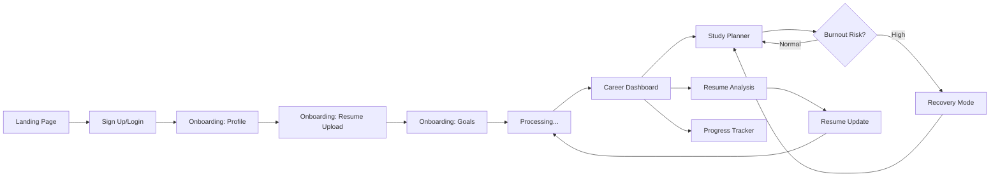

---

## Screen 1: Landing & Onboarding

### 1.1 Landing Page Layout

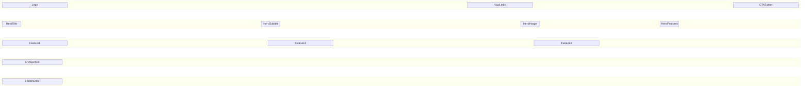

### 1.2 Onboarding: Resume Upload Page

**Validates:** REQ-SIM-001, REQ-SIM-003, REQ-SIM-004

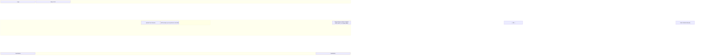

#### UI Components: Resume Upload Page

| Element Name | Functionality | Interaction | Validation | Reference |
|-------------|---------------|-------------|------------|-----------|
| **Upload Zone** | Drag-and-drop area for resume files | Click to open file picker, drag files to upload | Accept PDF/DOCX/TXT, max 5MB, show error for invalid files | REQ-SIM-001, CONST-005 |
| **Progress Indicator** | Shows upload progress (0-100%) | Animated progress bar during upload | Display file size and upload speed | REQ-RES-001 |
| **File Preview** | Shows uploaded file name and size | Click to remove and re-upload | Display file icon based on type | REQ-SIM-001 |
| **Manual Entry Link** | Alternative to file upload | Opens form for manual profile entry | Navigate to manual entry form | REQ-SIM-002 |
| **Next Button** | Proceeds to goal setting | Enabled only after successful upload | Validate file uploaded before proceeding | REQ-SIM-004 |

### 1.3 Onboarding: Profile & Goals Page

**Validates:** REQ-SIM-003, REQ-SIM-005

```mermaid
block-beta
  columns 12
  
  block:header:12
    Logo ProgressBar["Step 3 of 3"] space:8
  end
  
  space:12
  
  block:main:12
    space:2
    block:form:8
      Title["Set Your Career Goals"]
      space:8
      TargetRole["Target Role Dropdown"]
      space:8
      LearningSpeed["Learning Speed Slider (1-10)"]
      space:8
      WeeklyHours["Weekly Available Hours"]
      space:8
      ExperienceLevel["Experience Level Radio"]
      space:8
      WarningBanner["⚠️ Warning: >80 hrs/week unsustainable"]
    end
    space:2
  end
  
  space:12
  
  block:footer:12
    BackButton space:8 SubmitButton["Generate My Career Path"]
  end
```

#### UI Components: Profile & Goals Page

| Element Name | Functionality | Interaction | Validation | Reference |
|-------------|---------------|-------------|------------|-----------|
| **Target Role Dropdown** | Select desired career role | Searchable dropdown with common roles (Backend Dev, ML Engineer, etc.) | Required field | REQ-SIM-003 |
| **Learning Speed Slider** | Rate learning ability (1-10) | Drag slider, show descriptive labels (Slow, Average, Fast) | Default: 5, Range: 1-10 | REQ-SIM-003 |
| **Weekly Hours Input** | Enter available study hours | Number input with +/- buttons | Min: 0, Max: 168, show warning if >80 | REQ-SIM-003, REQ-SIM-005 |
| **Experience Level** | Select current level | Radio buttons: Fresher, Junior, Mid, Senior | Required field | REQ-SIM-003 |
| **Warning Banner** | Alert for unsustainable hours | Appears when hours > 80 | Recommend reducing to 60 hours max | REQ-SIM-005 |
| **Submit Button** | Start career analysis | Triggers trajectory generation | Validate all required fields | REQ-SIM-004 |

---

## Screen 2: Career Trajectory Dashboard

### 2.1 Dashboard Layout

**Validates:** REQ-SIM-006, REQ-SIM-007, REQ-SIM-021, REQ-PROG-016


### 2.2 Career Trajectory Chart

**Validates:** REQ-SIM-006, REQ-SIM-007, REQ-SIM-010

```
┌─────────────────────────────────────────────────────────────┐
│  Your 5-Year Career Trajectory                    [?] Help  │
├─────────────────────────────────────────────────────────────┤
│                                                               │
│  Scenario: ● Best Case  ○ Average Case  ○ Worst Case       │
│                                                               │
│  ₹ LPA                                                       │
│  35 ┤                                          ●             │
│     │                                      ●                 │
│  30 ┤                                  ●                     │
│     │                              ●                         │
│  25 ┤                          ●                             │
│     │                      ●                                 │
│  20 ┤                  ●                                     │
│     │              ●                                         │
│  15 ┤          ●                                             │
│     │      ●                                                 │
│  10 ┤  ●                                                     │
│     │                                                         │
│   5 ┤                                                         │
│     └─────┬─────┬─────┬─────┬─────┬─────                   │
│         Year 1  Year 2  Year 3  Year 4  Year 5             │
│                                                               │
│  Confidence Interval: ±₹2.5 LPA                             │
│  Current Position: Junior Developer                          │
│  Target Position: Senior Backend Engineer                    │
│                                                               │
└─────────────────────────────────────────────────────────────┘
```

#### UI Components: Career Trajectory Dashboard

| Element Name | Functionality | Interaction | Visualization | Reference |
|-------------|---------------|-------------|---------------|-----------|
| **Scenario Toggle** | Switch between best/average/worst case | Click to toggle, updates chart instantly | Tab-style buttons with active state | REQ-SIM-006 |
| **Salary Chart** | Line chart showing 5-year salary progression | Hover to see exact values, confidence intervals | Shaded area for confidence intervals | REQ-SIM-007, REQ-SIM-010 |
| **Year Markers** | Show role transitions | Click to see detailed breakdown | Vertical dotted lines at transition points | REQ-SIM-008 |
| **Confidence Badge** | Display prediction confidence | Tooltip explains confidence calculation | Percentage badge (e.g., "85% Confident") | REQ-SIM-010 |
| **Export Button** | Download trajectory as PDF | Click to generate and download | Icon button in top-right | REQ-PROG-019 |

### 2.3 Path Comparison View

**Validates:** REQ-SIM-021, REQ-SIM-022

```
┌─────────────────────────────────────────────────────────────┐
│  Compare Different Paths                                     │
├─────────────────────────────────────────────────────────────┤
│                                                               │
│  ┌──────────────────────┐    ┌──────────────────────┐      │
│  │  With 2 Internships  │    │  Without Internships │      │
│  ├──────────────────────┤    ├──────────────────────┤      │
│  │                      │    │                      │      │
│  │  Year 5 Salary       │    │  Year 5 Salary       │      │
│  │  ₹18 LPA            │    │  ₹6 LPA             │      │
│  │                      │    │                      │      │
│  │  ✓ System Design     │    │  ✗ System Design     │      │
│  │  ✓ Cloud (AWS)       │    │  ✗ Cloud (AWS)       │      │
│  │  ✓ Microservices     │    │  ✗ Microservices     │      │
│  │                      │    │                      │      │
│  │  Timeline: 2 years   │    │  Timeline: 2 years   │      │
│  │  Effort: High        │    │  Effort: Low         │      │
│  │                      │    │                      │      │
│  │  [Select This Path]  │    │  [Select This Path]  │      │
│  └──────────────────────┘    └──────────────────────┘      │
│                                                               │
│  💡 Impact: +₹12 LPA by doing 2 internships                 │
│                                                               │
└─────────────────────────────────────────────────────────────┘
```

#### UI Components: Path Comparison

| Element Name | Functionality | Interaction | Visualization | Reference |
|-------------|---------------|-------------|---------------|-----------|
| **Scenario Cards** | Display side-by-side path options | Click to expand details | Card layout with key metrics | REQ-SIM-021 |
| **Salary Difference** | Highlight salary impact | Animated number counter | Large, bold text with ₹ symbol | REQ-SIM-022 |
| **Skill Checklist** | Show skills gained in each path | Checkmarks for acquired skills | Icon list with green/red indicators | REQ-SIM-011 |
| **Impact Banner** | Quantify action impact | Sticky banner at bottom | Highlighted box with lightbulb icon | REQ-SIM-022 |
| **Select Path Button** | Choose preferred scenario | Updates study plan accordingly | Primary CTA button | REQ-INT-002 |

### 2.4 Skill Gaps Analysis

**Validates:** REQ-SIM-011, REQ-SIM-012, REQ-SIM-013

```
┌─────────────────────────────────────────────────────────────┐
│  Skill Gaps for Backend Developer Role                      │
├─────────────────────────────────────────────────────────────┤
│                                                               │
│  ┌─ CORE SKILLS (Must Have) ──────────────────────────┐    │
│  │                                                       │    │
│  │  1. System Design                    Impact: 95/100  │    │
│  │     ████████████████████░░  Est. Time: 120 hrs      │    │
│  │     Salary Impact: +₹4.5 LPA                        │    │
│  │     [Start Learning]                                 │    │
│  │                                                       │    │
│  │  2. Data Structures & Algorithms     Impact: 92/100  │    │
│  │     ████████████████████░░  Est. Time: 150 hrs      │    │
│  │     Salary Impact: +₹4.0 LPA                        │    │
│  │     [Start Learning]                                 │    │
│  │                                                       │    │
│  └───────────────────────────────────────────────────────┘    │
│                                                               │
│  ┌─ IMPORTANT SKILLS (Should Have) ────────────────────┐    │
│  │                                                       │    │
│  │  3. AWS/Cloud Services               Impact: 78/100  │    │
│  │     ████████████████░░░░  Est. Time: 80 hrs         │    │
│  │     Salary Impact: +₹2.5 LPA                        │    │
│  │     [Start Learning]                                 │    │
│  │                                                       │    │
│  └───────────────────────────────────────────────────────┘    │
│                                                               │
│  ┌─ NICE-TO-HAVE SKILLS ───────────────────────────────┐    │
│  │                                                       │    │
│  │  4. GraphQL                          Impact: 45/100  │    │
│  │     █████████░░░░░░░░░░  Est. Time: 40 hrs          │    │
│  │     Salary Impact: +₹1.0 LPA                        │    │
│  │     [Start Learning]                                 │    │
│  │                                                       │    │
│  └───────────────────────────────────────────────────────┘    │
│                                                               │
│  Total Learning Time: 390 hours (~20 weeks at 20 hrs/week)  │
│  Total Salary Potential: +₹12 LPA                           │
│                                                               │
└─────────────────────────────────────────────────────────────┘
```

#### UI Components: Skill Gaps Analysis

| Element Name | Functionality | Interaction | Visualization | Reference |
|-------------|---------------|-------------|---------------|-----------|
| **Skill Category Sections** | Group skills by importance | Collapsible sections | Color-coded headers (Red/Yellow/Green) | REQ-SIM-013 |
| **Impact Score Bar** | Visual representation of skill impact | Hover to see detailed breakdown | Horizontal progress bar (0-100) | REQ-SIM-012 |
| **Learning Time Badge** | Estimated hours to master | Based on user's learning speed | Pill-shaped badge with clock icon | REQ-SIM-014 |
| **Salary Impact Label** | Potential salary increase | Calculated from market data | Bold text with ₹ symbol | REQ-SIM-012 |
| **Start Learning Button** | Navigate to study plan | Adds skill to learning roadmap | Secondary CTA button | REQ-PLAN-001 |
| **Dependency Graph** | Show skill prerequisites | Click to expand graph view | Network diagram with arrows | REQ-SIM-015 |

---

## Screen 3: Resume Intelligence View

### 3.1 Resume Analysis Layout

**Validates:** REQ-RES-003, REQ-RES-009, REQ-RES-018, REQ-RES-019

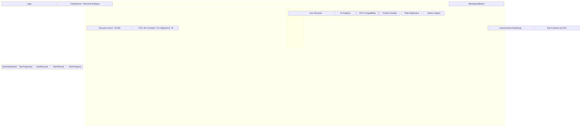

### 3.2 Resume Score Overview

**Validates:** REQ-RES-003, REQ-RES-004

```
┌─────────────────────────────────────────────────────────────┐
│  Resume Analysis                        [Re-analyze Resume]  │
├─────────────────────────────────────────────────────────────┤
│                                                               │
│         ┌─────────────┐                                      │
│         │             │                                      │
│         │     72      │  Overall Score                       │
│         │    /100     │  ⚠️ Needs Improvement                │
│         │             │                                      │
│         └─────────────┘                                      │
│                                                               │
│  ┌──────────────┐  ┌──────────────┐  ┌──────────────┐      │
│  │ ATS: 65/100  │  │ Content: 75  │  │ Alignment: 76│      │
│  │ ⚠️ Issues: 4  │  │ ✓ Good       │  │ ✓ Good       │      │
│  │ [View]       │  │ [View]       │  │ [View]       │      │
│  └──────────────┘  └──────────────┘  └──────────────┘      │
│                                                               │
│  Analyzed: 2 minutes ago | Processing Time: 3.2s            │
│                                                               │
└─────────────────────────────────────────────────────────────┘
```

### 3.3 Split View: Resume + Analysis

**Validates:** REQ-RES-009, REQ-RES-010, REQ-RES-011

```
┌─────────────────────────────────────────────────────────────┐
│  Your Resume                │  AI Analysis                   │
├─────────────────────────────┼────────────────────────────────┤
│                             │                                │
│  JOHN DOE                   │  ⚠️ Weak Bullets Detected      │
│  john@email.com             │                                │
│                             │  Line 12: "Worked on project"  │
│  EXPERIENCE                 │  Score: 35/100                 │
│  ─────────────              │                                │
│  Software Engineer          │  Issues:                       │
│  TechCorp | 2022-2024       │  • No action verb              │
│                             │  • Missing quantification      │
│  • Developed features       │  • Vague description           │
│    ✓ Good (Score: 78)       │                                │
│                             │  Suggested Improvement:        │
│  • Worked on project        │  "Architected and deployed     │
│    ⚠️ Weak (Score: 35)      │   microservices platform       │
│                             │   serving 50K+ daily users,    │
│  • Improved performance     │   reducing latency by 40%"     │
│    ⚠️ Weak (Score: 42)      │                                │
│                             │  Salary Impact: +₹0.8 LPA      │
│  SKILLS                     │  Effort: Low                   │
│  ─────────────              │  ROI: High ⭐⭐⭐              │
│  Python, JavaScript, SQL    │                                │
│  ✓ Relevant for Backend     │  [Apply Suggestion]            │
│                             │  [Edit Manually]               │
│  PROJECTS                   │                                │
│  ─────────────              │  ────────────────────────      │
│  E-commerce Platform        │                                │
│  • Built REST API           │  💡 Missing Keywords           │
│    ✓ Good (Score: 82)       │                                │
│                             │  Your resume lacks:            │
│                             │  • "System Design" (80% JDs)   │
│                             │  • "Microservices" (75% JDs)   │
│                             │  • "AWS/Cloud" (70% JDs)       │
│                             │                                │
│                             │  Adding these could improve    │
│                             │  your Backend role probability │
│                             │  by 32%                        │
│                             │                                │
└─────────────────────────────┴────────────────────────────────┘
```

#### UI Components: Resume Analysis View

| Element Name | Functionality | Interaction | Visualization | Reference |
|-------------|---------------|-------------|---------------|-----------|
| **Overall Score Circle** | Display resume score (0-100) | Animated circular progress | Color-coded: Red (<60), Yellow (60-79), Green (80+) | REQ-RES-003 |
| **Score Breakdown Cards** | Show ATS, Content, Alignment scores | Click to jump to detailed section | Card grid with mini scores | REQ-RES-004 |
| **Resume Preview** | Display uploaded resume | Scroll through pages, zoom in/out | PDF viewer with highlighting | REQ-RES-001 |
| **Weak Bullet Highlights** | Mark low-scoring bullets in resume | Hover to see score and issues | Yellow/red highlights on text | REQ-RES-009 |
| **Bullet Score Badge** | Show individual bullet scores | Click to see detailed analysis | Inline badge with color coding | REQ-RES-009 |
| **Improvement Suggestions** | AI-generated better versions | Click to apply or edit | Side panel with before/after | REQ-RES-010, REQ-RES-011 |
| **Missing Keywords Panel** | List keywords from job descriptions | Click to add to resume | Expandable list with frequency % | REQ-RES-015 |
| **Salary Impact Label** | Show potential salary increase | Tooltip explains calculation | Bold text with ₹ symbol | REQ-RES-019 |
| **ROI Stars** | Visual ROI indicator | 1-5 stars based on effort/impact | Star rating component | REQ-RES-021 |
| **Apply Suggestion Button** | Insert AI suggestion into resume | Opens editor with pre-filled text | Primary action button | REQ-RES-020 |

### 3.4 Impact Feedback Section

**Validates:** REQ-RES-018, REQ-RES-019

```
┌─────────────────────────────────────────────────────────────┐
│  Career Impact Analysis                                      │
├─────────────────────────────────────────────────────────────┤
│                                                               │
│  Current Trajectory: ₹6 LPA Path                            │
│  Potential Trajectory: ₹18 LPA Path (+₹12 LPA)             │
│                                                               │
│  ┌─────────────────────────────────────────────────────┐    │
│  │  Why You're on the 6 LPA Path                       │    │
│  ├─────────────────────────────────────────────────────┤    │
│  │                                                       │    │
│  │  ❌ Lack of system design experience                 │    │
│  │     Reduces backend role probability by 32%          │    │
│  │     Salary Impact: -₹4.5 LPA                        │    │
│  │                                                       │    │
│  │  ❌ No cloud/AWS mentions                            │    │
│  │     Reduces backend role probability by 18%          │    │
│  │     Salary Impact: -₹2.5 LPA                        │    │
│  │                                                       │    │
│  │  ❌ Weak quantification in bullets                   │    │
│  │     Reduces credibility score by 25%                 │    │
│  │     Salary Impact: -₹1.5 LPA                        │    │
│  │                                                       │    │
│  └───────────────────────────────────────────────────────┘    │
│                                                               │
│  ┌─────────────────────────────────────────────────────┐    │
│  │  How to Reach 18 LPA Path                           │    │
│  ├─────────────────────────────────────────────────────┤    │
│  │                                                       │    │
│  │  ✅ Add system design project                        │    │
│  │     Effort: 2 weeks | Impact: +₹4.5 LPA | ROI: ⭐⭐⭐ │    │
│  │     [Start Project]                                  │    │
│  │                                                       │    │
│  │  ✅ Get AWS certification                            │    │
│  │     Effort: 3 weeks | Impact: +₹2.5 LPA | ROI: ⭐⭐⭐ │    │
│  │     [View Courses]                                   │    │
│  │                                                       │    │
│  │  ✅ Quantify all achievements                        │    │
│  │     Effort: 1 day | Impact: +₹1.5 LPA | ROI: ⭐⭐⭐⭐⭐│    │
│  │     [Fix Now]                                        │    │
│  │                                                       │    │
│  └───────────────────────────────────────────────────────┘    │
│                                                               │
└─────────────────────────────────────────────────────────────┘
```

#### UI Components: Impact Feedback

| Element Name | Functionality | Interaction | Visualization | Reference |
|-------------|---------------|-------------|---------------|-----------|
| **Trajectory Comparison** | Show current vs potential path | Animated transition between states | Large numbers with +/- indicators | REQ-RES-018 |
| **Issue Cards** | List resume weaknesses | Expandable for more details | Red X icon with impact metrics | REQ-RES-018 |
| **Probability Reduction** | Show % decrease in role chances | Tooltip explains calculation | Percentage with down arrow | REQ-RES-018 |
| **Improvement Cards** | List prioritized actions | Click to start action | Green checkmark with ROI stars | REQ-RES-019, REQ-RES-021 |
| **Effort Badge** | Show time required | Color-coded by duration | Pill badge (Low/Medium/High) | REQ-RES-019 |
| **Impact Amount** | Display salary increase | Bold, large text | ₹ symbol with LPA | REQ-RES-019 |
| **Action Buttons** | Start improvement tasks | Navigate to relevant section | Primary CTA buttons | REQ-RES-022 |

---

## Screen 4: Adaptive Study Planner

### 4.1 Study Planner Layout

**Validates:** REQ-PLAN-002, REQ-PLAN-003, REQ-BURN-016

```mermaid
block-beta
  columns 12
  
  block:header:12
    Logo Breadcrumb["Dashboard > Study Planner"] space:4 MoodButton BurnoutMeter
  end
  
  block:sidebar:2
    NavDashboard
    NavTrajectory
    NavResume
    NavPlanner
    NavProgress
  end
  
  block:main:10
    block:alert:10
      RecoveryBanner["🛡️ Recovery Mode Active - Reduced Intensity"]
    end
    
    space:10
    
    block:calendar:10
      WeekSelector["← Week 3 of 24 →"]
      WeeklyGoal["Goal: Master DSA Basics"]
      WeeklyProgress["12/15 tasks completed (80%)"]
    end
    
    space:10
    
    block:today:10
      TodayTitle["Today's Tasks - Monday, Feb 14"]
      TaskList["Task 1 | Task 2 | Task 3"]
    end
    
    space:10
    
    block:upcoming:10
      UpcomingTitle["This Week"]
      WeeklySchedule["Mon | Tue | Wed | Thu | Fri | Sat | Sun"]
    end
    
    space:10
    
    block:milestones:10
      MilestoneTitle["Upcoming Milestones"]
      MilestoneTimeline["Timeline View"]
    end
  end
```

### 4.2 Daily Task List

**Validates:** REQ-PLAN-003, REQ-PLAN-012

```
┌─────────────────────────────────────────────────────────────┐
│  Today's Tasks - Monday, February 14, 2026                  │
│  Total Time: 4.5 hours | Completed: 2/5                     │
├─────────────────────────────────────────────────────────────┤
│                                                               │
│  ☑️ 1. Watch: Introduction to Binary Trees                  │
│     Skill: Data Structures | Time: 45 min | Difficulty: 🟢  │
│     Status: Completed at 10:30 AM                           │
│     Resources: [YouTube Link] [Notes]                       │
│                                                               │
│  ☑️ 2. Practice: Solve 5 Array Problems                     │
│     Skill: DSA | Time: 90 min | Difficulty: 🟡              │
│     Status: Completed at 2:15 PM                            │
│     Resources: [LeetCode] [Solutions]                       │
│                                                               │
│  ☐ 3. Read: System Design Primer (Ch 1-2)                  │
│     Skill: System Design | Time: 60 min | Difficulty: 🟡    │
│     Status: In Progress (30% done)                          │
│     Resources: [GitHub Link] [Bookmark]                     │
│     [Continue] [Mark Complete] [Skip]                       │
│                                                               │
│  ☐ 4. Code: Build REST API Endpoint                        │
│     Skill: Backend Dev | Time: 120 min | Difficulty: 🔴     │
│     Status: Not Started                                      │
│     Depends on: Task 3                                       │
│     Resources: [Tutorial] [Starter Code]                    │
│     [Start] [Reschedule]                                    │
│                                                               │
│  ☐ 5. Review: Yesterday's Concepts                         │
│     Skill: General | Time: 30 min | Difficulty: 🟢          │
│     Status: Not Started                                      │
│     Resources: [Flashcards] [Quiz]                          │
│     [Start]                                                  │
│                                                               │
│  ⏰ Recommended Break: Take a 15-min break after Task 4     │
│                                                               │
└─────────────────────────────────────────────────────────────┘
```

#### UI Components: Daily Task List

| Element Name | Functionality | Interaction | Visualization | Reference |
|-------------|---------------|-------------|---------------|-----------|
| **Task Checkbox** | Mark task as complete | Click to toggle completion | Animated checkmark | REQ-PLAN-012 |
| **Task Card** | Display task details | Expand for full description | Card with color-coded border | REQ-PLAN-003 |
| **Difficulty Indicator** | Show task complexity | Color-coded dots (Green/Yellow/Red) | Emoji or colored circle | REQ-PLAN-003 |
| **Time Badge** | Estimated completion time | Based on user's learning speed | Clock icon with minutes | REQ-PLAN-003 |
| **Skill Tag** | Associated skill category | Click to see all tasks for skill | Colored pill badge | REQ-PLAN-003 |
| **Progress Bar** | Show in-progress task completion | Updates in real-time | Horizontal bar (0-100%) | REQ-PLAN-012 |
| **Resource Links** | Learning materials | Open in new tab | Icon buttons (video, article, code) | REQ-PLAN-007 |
| **Action Buttons** | Task controls | Start, Complete, Skip, Reschedule | Button group at bottom | REQ-PLAN-012, REQ-PLAN-013 |
| **Dependency Indicator** | Show prerequisite tasks | Hover to see dependency chain | Lock icon with tooltip | REQ-PLAN-003 |
| **Break Reminder** | Suggest rest periods | Appears after 2 hours of tasks | Info banner with timer icon | REQ-BURN-018, REQ-BURN-023 |

### 4.3 Mood Tracking Interface

**Validates:** REQ-BURN-006, REQ-BURN-007, REQ-BURN-009

```
┌─────────────────────────────────────────────────────────────┐
│  How are you feeling today?                          [Close] │
├─────────────────────────────────────────────────────────────┤
│                                                               │
│  Select your mood:                                           │
│                                                               │
│    😫      😟      😐      🙂      😄                        │
│    1       2       3       4       5                         │
│   Very   Low    Okay   Good   Great                         │
│    Low                                                       │
│                                                               │
│  ─────────────────────────────────────────────────────       │
│                                                               │
│  Optional: Tell us more (helps us understand better)         │
│  ┌─────────────────────────────────────────────────────┐    │
│  │ Feeling overwhelmed with the workload...            │    │
│  │                                                       │    │
│  │                                                       │    │
│  └───────────────────────────────────────────────────────┘    │
│                                                               │
│  Tags (optional):                                            │
│  [#stressed] [#motivated] [#tired] [#focused] [+Add]        │
│                                                               │
│  ─────────────────────────────────────────────────────       │
│                                                               │
│  Your mood trend (last 7 days):                             │
│                                                               │
│   5 ┤     ●                                                  │
│   4 ┤   ●   ●   ●                                            │
│   3 ┤ ●           ●                                          │
│   2 ┤               ●   ●  ← Today                          │
│   1 ┤                                                         │
│     └─────────────────────                                   │
│     Mon Tue Wed Thu Fri Sat Sun                             │
│                                                               │
│  ⚠️ We've noticed your mood has been low for 2 days.        │
│     Consider taking a break or reducing your workload.       │
│                                                               │
│  [Submit Mood Log]                                           │
│                                                               │
└─────────────────────────────────────────────────────────────┘
```

#### UI Components: Mood Tracking

| Element Name | Functionality | Interaction | Visualization | Reference |
|-------------|---------------|-------------|---------------|-----------|
| **Mood Emoji Selector** | Rate mood (1-5 scale) | Click emoji to select | Large, interactive emojis | REQ-BURN-006 |
| **Mood Notes Textarea** | Optional text input | Free-form text entry | Expandable text area | REQ-BURN-006 |
| **Sentiment Analysis** | Analyze text for stress indicators | Automatic on submit | Background processing | REQ-BURN-007, REQ-BURN-008 |
| **Mood Tags** | Quick mood descriptors | Click to toggle tags | Pill-shaped buttons | REQ-BURN-006 |
| **Mood Trend Chart** | 7-day mood history | Hover to see exact ratings | Line chart with dots | REQ-BURN-009 |
| **Low Mood Warning** | Alert for consecutive low days | Appears when mood < 2 for 3+ days | Warning banner | REQ-BURN-009 |
| **Submit Button** | Save mood log | Triggers burnout risk recalculation | Primary CTA button | REQ-BURN-007 |

### 4.4 Recovery Mode Banner

**Validates:** REQ-BURN-011, REQ-BURN-012, REQ-BURN-013

```
┌─────────────────────────────────────────────────────────────┐
│  🛡️ Recovery Mode Active                            [Exit?] │
├─────────────────────────────────────────────────────────────┤
│                                                               │
│  We've reduced your workload by 50% to help you recover.    │
│  Focus on light tasks and take care of yourself! 💚          │
│                                                               │
│  Activated: 2 days ago | Duration: 7 days                    │
│  Reason: Low mood for 3 consecutive days                     │
│                                                               │
│  ✨ Your Progress Highlights:                                │
│  • Completed 45 tasks this month                             │
│  • Mastered 3 new skills                                     │
│  • Maintained 21-day streak before this                      │
│                                                               │
│  💡 Recovery Tips:                                           │
│  • Focus on reading and watching videos (no coding)          │
│  • Take regular breaks every hour                            │
│  • Get 7-8 hours of sleep                                    │
│  • Exercise or go for a walk                                 │
│                                                               │
│  Exit Criteria: Mood rating ≥ 3 for 3 consecutive days      │
│  Current: Day 2 of 3 ✓✓○                                    │
│                                                               │
└─────────────────────────────────────────────────────────────┘
```

#### UI Components: Recovery Mode

| Element Name | Functionality | Interaction | Visualization | Reference |
|-------------|---------------|-------------|---------------|-----------|
| **Recovery Banner** | Alert user of reduced intensity | Persistent at top of planner | Full-width banner with shield icon | REQ-BURN-011 |
| **Activation Info** | Show when and why activated | Tooltip with full details | Inline text with info icon | REQ-BURN-011 |
| **Progress Highlights** | Motivational achievements | Celebrate past successes | Bulleted list with emojis | REQ-BURN-013 |
| **Recovery Tips** | Wellness recommendations | Expandable list | Card with lightbulb icon | REQ-BURN-013 |
| **Exit Criteria Progress** | Show days until exit | Visual progress indicator | Checkmark sequence | REQ-BURN-014 |
| **Exit Button** | Manually exit Recovery Mode | Requires confirmation dialog | Secondary button | REQ-BURN-014 |
| **Reduced Schedule** | Show modified task list | Only low-intensity tasks visible | Filtered task list | REQ-BURN-012 |

### 4.5 Burnout Risk Meter

**Validates:** REQ-BURN-016, REQ-BURN-017

```
┌─────────────────────────────────────────────────────────────┐
│  Burnout Risk Monitor                                [Info]  │
├─────────────────────────────────────────────────────────────┤
│                                                               │
│                    Current Risk: 28%                         │
│                                                               │
│         ┌─────────────────────────────────────┐             │
│         │░░░░░░░░░░░░░░░░░░░░░░░░░░░░░░░░░░░░│             │
│         │████████░░░░░░░░░░░░░░░░░░░░░░░░░░░░│             │
│         └─────────────────────────────────────┘             │
│         0%        25%       50%       75%      100%          │
│         Low     Moderate    High    Critical                │
│                                                               │
│  Status: 🟢 Safe Zone - Keep up the good work!              │
│                                                               │
│  Contributing Factors:                                       │
│  ┌───────────────────────────────────────────────────┐      │
│  │ Study Hours (7-day avg)        6.2 hrs  ✓ Good   │      │
│  │ Contribution: 15%                                 │      │
│  │ ████░░░░░░░░░░░░░░░░░░░░░░░░░░░░░░░░░░░░░░      │      │
│  │                                                    │      │
│  │ Task Completion Rate           85%     ✓ Good    │      │
│  │ Contribution: 5%                                  │      │
│  │ ██░░░░░░░░░░░░░░░░░░░░░░░░░░░░░░░░░░░░░░░░      │      │
│  │                                                    │      │
│  │ Mood Trend                     3.8/5    ✓ Good   │      │
│  │ Contribution: 5%                                  │      │
│  │ ██░░░░░░░░░░░░░░░░░░░░░░░░░░░░░░░░░░░░░░░░      │      │
│  │                                                    │      │
│  │ Consistency                    Stable   ✓ Good   │      │
│  │ Contribution: 3%                                  │      │
│  │ █░░░░░░░░░░░░░░░░░░░░░░░░░░░░░░░░░░░░░░░░░      │      │
│  └───────────────────────────────────────────────────┘      │
│                                                               │
│  Recommendations:                                            │
│  • Maintain current pace - you're doing great!               │
│  • Take at least 1 rest day this week                        │
│  • Log your mood daily to track trends                       │
│                                                               │
└─────────────────────────────────────────────────────────────┘
```

#### UI Components: Burnout Risk Meter

| Element Name | Functionality | Interaction | Visualization | Reference |
|-------------|---------------|-------------|---------------|-----------|
| **Risk Gauge** | Display burnout risk (0-100%) | Animated gauge with color zones | Horizontal bar or circular gauge | REQ-BURN-016 |
| **Risk Level Badge** | Show risk category | Color-coded: Green/Yellow/Orange/Red | Large badge with status text | REQ-BURN-016 |
| **Factor Breakdown** | Show contributing factors | Expandable sections for details | Stacked bar chart | REQ-BURN-016 |
| **Factor Contribution** | Individual factor impact | Hover to see calculation | Mini progress bars | REQ-BURN-016 |
| **Study Hours Indicator** | 7-day rolling average | Line chart in tooltip | Number with trend arrow | REQ-BURN-002 |
| **Mood Trend Indicator** | Average mood rating | Mini sparkline chart | Number with emoji | REQ-BURN-009 |
| **Warning Threshold** | Alert when risk > 70% | Red border and warning icon | Pulsing animation | REQ-BURN-017 |
| **Recommendations List** | Personalized suggestions | Based on risk factors | Bulleted list with icons | REQ-BURN-016 |
| **Block Intensive Tasks** | Prevent overload | Disable "Add Task" when risk > 70% | Disabled button with tooltip | REQ-BURN-017 |

---

## Screen 5: Progress Intelligence Dashboard

### 5.1 Progress Dashboard Layout

**Validates:** REQ-PROG-016, REQ-PROG-017, REQ-PROG-020

```mermaid
block-beta
  columns 12
  
  block:header:12
    Logo Breadcrumb["Dashboard > Progress"] space:6 ExportButton
  end
  
  block:sidebar:2
    NavDashboard
    NavTrajectory
    NavResume
    NavPlanner
    NavProgress
  end
  
  block:main:10
    block:overview:10
      ProgressCircle["67% Complete"]
      SkillsMastered["8 Skills"]
      CurrentStreak["21 Days 🔥"]
      NextMilestone["Interview Ready"]
    end
    
    space:10
    
    block:velocity:10
      VelocityTitle["Learning Velocity"]
      VelocityChart["Trend Chart"]
      PeerComparison["vs Peers"]
    end
    
    space:10
    
    block:skills:10
      SkillsTitle["Skill Proficiency"]
      RadarChart["Radar Chart"]
      SkillList["Detailed List"]
    end
    
    space:10
    
    block:achievements:10
      AchievementsTitle["Achievements & Badges"]
      BadgeGrid["Badge Collection"]
    end
  end
```

### 5.2 Progress Overview Cards

**Validates:** REQ-PROG-016, REQ-PROG-013

```
┌─────────────────────────────────────────────────────────────┐
│  Your Progress Overview                      [Export Report] │
├─────────────────────────────────────────────────────────────┤
│                                                               │
│  ┌──────────────┐  ┌──────────────┐  ┌──────────────┐      │
│  │              │  │              │  │              │      │
│  │      67%     │  │      8       │  │   21 Days    │      │
│  │   Complete   │  │    Skills    │  │   🔥 Streak  │      │
│  │              │  │   Mastered   │  │              │      │
│  │  ●●●●●●●○○○  │  │  DSA, APIs,  │  │  Longest: 45 │      │
│  │              │  │  SQL, Git... │  │              │      │
│  └──────────────┘  └──────────────┘  └──────────────┘      │
│                                                               │
│  ┌──────────────┐  ┌──────────────┐  ┌──────────────┐      │
│  │              │  │              │  │              │      │
│  │ Next Goal    │  │  Burnout     │  │  Time to     │      │
│  │ Interview    │  │   Risk       │  │   Goal       │      │
│  │   Ready      │  │              │  │              │      │
│  │              │  │     28%      │  │  23 Days     │      │
│  │  23 days     │  │   🟢 Safe    │  │  (on track)  │      │
│  │              │  │              │  │              │      │
│  └──────────────┘  └──────────────┘  └──────────────┘      │
│                                                               │
└─────────────────────────────────────────────────────────────┘
```

### 5.3 Learning Velocity Chart

**Validates:** REQ-PROG-001, REQ-PROG-002, REQ-PROG-003, REQ-PROG-004

```
┌─────────────────────────────────────────────────────────────┐
│  Learning Velocity Trend                                     │
├─────────────────────────────────────────────────────────────┤
│                                                               │
│  Current Velocity: 8.5 skills/month                         │
│  Trend: ↗️ Increasing (+15% vs last month)                  │
│                                                               │
│  Velocity                                                    │
│  10 ┤                                          ●             │
│     │                                      ●                 │
│   9 ┤                                  ●                     │
│     │                              ●                         │
│   8 ┤                          ●                             │
│     │                      ●                                 │
│   7 ┤                  ●                                     │
│     │              ●                                         │
│   6 ┤          ●                                             │
│     │      ●                                                 │
│   5 ┤  ●                                                     │
│     └─────┬─────┬─────┬─────┬─────┬─────                   │
│         Week 1  Week 2  Week 3  Week 4  Week 5             │
│                                                               │
│  ─────────────────────────────────────────────────────       │
│                                                               │
│  Peer Comparison (Backend Developers, Fresher Level)        │
│                                                               │
│  Your Velocity:    8.5  ████████████████████░░░░░░  85%     │
│  Peer Average:     7.2  ████████████████░░░░░░░░░░  72%     │
│  Top 10%:         10.0  ████████████████████████████ 100%   │
│                                                               │
│  💡 You're performing 18% above average! Keep it up!        │
│                                                               │
│  ⚠️ Velocity dropped 30% in Week 3 - Possible causes:       │
│     • Increased task difficulty                              │
│     • Missed 3 days due to low mood                          │
│     • Longer tasks (System Design)                           │
│                                                               │
└─────────────────────────────────────────────────────────────┘
```

### 5.4 Skill Proficiency Radar Chart

**Validates:** REQ-PROG-006, REQ-PROG-008, REQ-PROG-020

```
┌─────────────────────────────────────────────────────────────┐
│  Skill Proficiency Analysis                                  │
├─────────────────────────────────────────────────────────────┤
│                                                               │
│                    System Design (45%)                       │
│                           ●                                  │
│                         ╱   ╲                                │
│                       ╱       ╲                              │
│         Cloud (60%) ●           ● DSA (75%)                 │
│                   ╱   ╲       ╱   ╲                          │
│                 ╱       ╲   ╱       ╲                        │
│               ╱           ●           ╲                      │
│             ╱         Backend         ╲                     │
│           ●          APIs (85%)         ●                    │
│      Database                        Git (90%)              │
│       (70%)                                                  │
│                                                               │
│  Legend:  ● Your Level    ○ Target Level                    │
│                                                               │
│  ─────────────────────────────────────────────────────       │
│                                                               │
│  Skill Details:                                              │
│                                                               │
│  ✅ Git & Version Control          90% ████████████████████  │
│     Expert Level | Last Updated: 2 days ago                 │
│     Mastery ETA: Achieved! 🎉                               │
│                                                               │
│  ✅ Backend APIs                   85% ██████████████████░░  │
│     Advanced Level | Last Updated: 1 week ago               │
│     Mastery ETA: 2 weeks                                    │
│                                                               │
│  🔄 Data Structures & Algorithms   75% ████████████████░░░░  │
│     Advanced Level | Last Updated: 3 days ago               │
│     Mastery ETA: 4 weeks                                    │
│     [Continue Learning]                                      │
│                                                               │
│  🔄 Database & SQL                 70% ██████████████░░░░░░  │
│     Intermediate Level | Last Updated: 5 days ago           │
│     Mastery ETA: 5 weeks                                    │
│     [Continue Learning]                                      │
│                                                               │
│  ⚠️ Cloud/AWS                      60% ████████████░░░░░░░░  │
│     Intermediate Level | Last Updated: 1 week ago           │
│     Mastery ETA: 8 weeks                                    │
│     [Focus Needed]                                           │
│                                                               │
│  ⚠️ System Design                  45% █████████░░░░░░░░░░░  │
│     Beginner Level | Last Updated: 2 weeks ago              │
│     Mastery ETA: 12 weeks                                   │
│     [High Priority]                                          │
│                                                               │
└─────────────────────────────────────────────────────────────┘
```

### 5.5 Achievements & Badges

**Validates:** REQ-PROG-014, REQ-PROG-015

```
┌─────────────────────────────────────────────────────────────┐
│  Achievements & Badges                                       │
├─────────────────────────────────────────────────────────────┤
│                                                               │
│  Recent Achievements:                                        │
│                                                               │
│  🏆 21-Day Streak                    Unlocked: 2 days ago   │
│     Completed tasks for 21 consecutive days                  │
│                                                               │
│  ⭐ DSA Master                       Unlocked: 1 week ago    │
│     Achieved 75% proficiency in Data Structures              │
│                                                               │
│  🎯 First Milestone                  Unlocked: 2 weeks ago   │
│     Reached "Resume Ready" milestone                         │
│                                                               │
│  ─────────────────────────────────────────────────────       │
│                                                               │
│  Badge Collection:                                           │
│                                                               │
│  ┌─────┐  ┌─────┐  ┌─────┐  ┌─────┐  ┌─────┐  ┌─────┐    │
│  │ 🔥  │  │ ⭐  │  │ 🎯  │  │ 💪  │  │ 🏆  │  │ 🌟  │    │
│  │  7  │  │  1  │  │  1  │  │  3  │  │  1  │  │ ??? │    │
│  │ Day │  │Skill│  │Mile-│  │Task │  │Long │  │ 30  │    │
│  │     │  │     │  │stone│  │ 50  │  │Strek│  │ Day │    │
│  └─────┘  └─────┘  └─────┘  └─────┘  └─────┘  └─────┘    │
│  Unlocked  Unlocked  Unlocked  Unlocked  Unlocked  Locked  │
│                                                               │
│  ┌─────┐  ┌─────┐  ┌─────┐  ┌─────┐  ┌─────┐  ┌─────┐    │
│  │ 🎓  │  │ 🚀  │  │ 💎  │  │ 👑  │  │ 🌈  │  │ ⚡  │    │
│  │ ??? │  │ ??? │  │ ??? │  │ ??? │  │ ??? │  │ ??? │    │
│  │Cert │  │Fast │  │100  │  │Top  │  │All  │  │Speed│    │
│  │     │  │Track│  │Task │  │ 1%  │  │Skill│  │Run  │    │
│  └─────┘  └─────┘  └─────┘  └─────┘  └─────┘  └─────┘    │
│  Locked    Locked    Locked    Locked    Locked    Locked  │
│                                                               │
│  Next Badge: 30-Day Streak (9 days to go!)                  │
│                                                               │
└─────────────────────────────────────────────────────────────┘
```

---

## User Flow Diagrams

### Flow 1: Onboarding to Career Trajectory

**Validates:** REQ-SIM-004, REQ-INT-001, REQ-INT-002

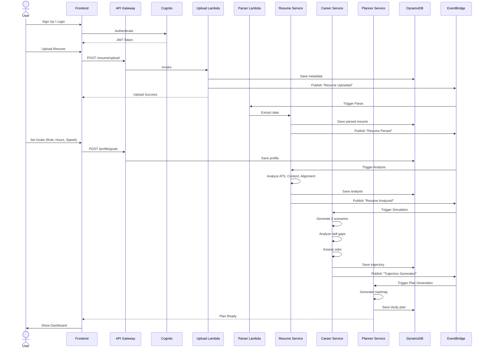

### Flow 2: Mood Logging to Burnout Detection

**Validates:** REQ-BURN-009, REQ-BURN-011, REQ-INT-003

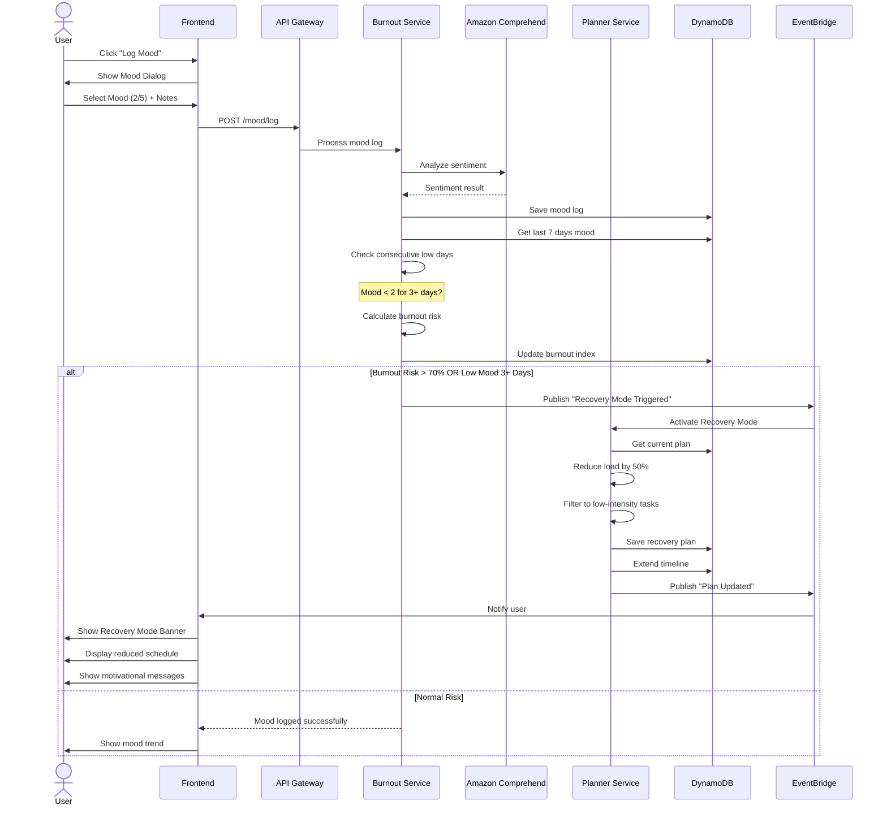

### Flow 3: Task Skip to Plan Rebalancing

**Validates:** REQ-PLAN-012, REQ-PLAN-013, REQ-INT-003

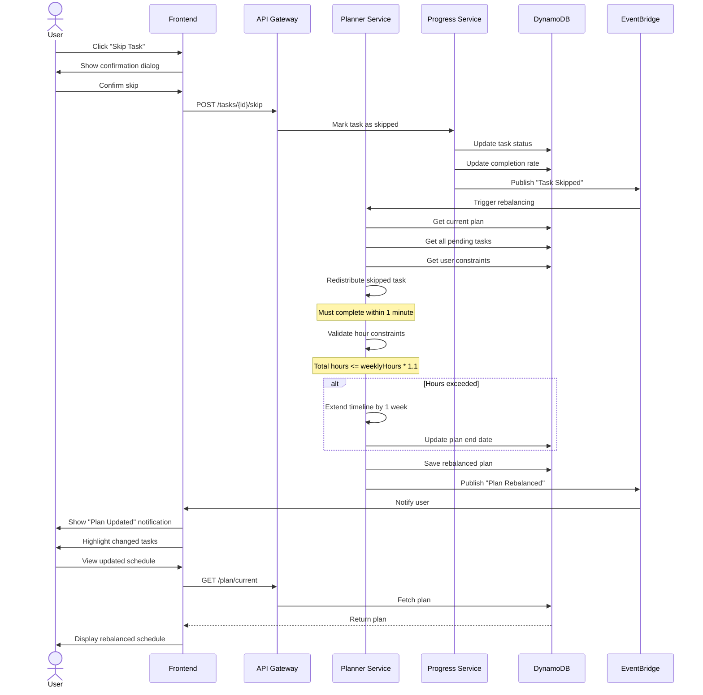

### Flow 4: Resume Update to Trajectory Recalculation

**Validates:** REQ-INT-004, REQ-INT-009

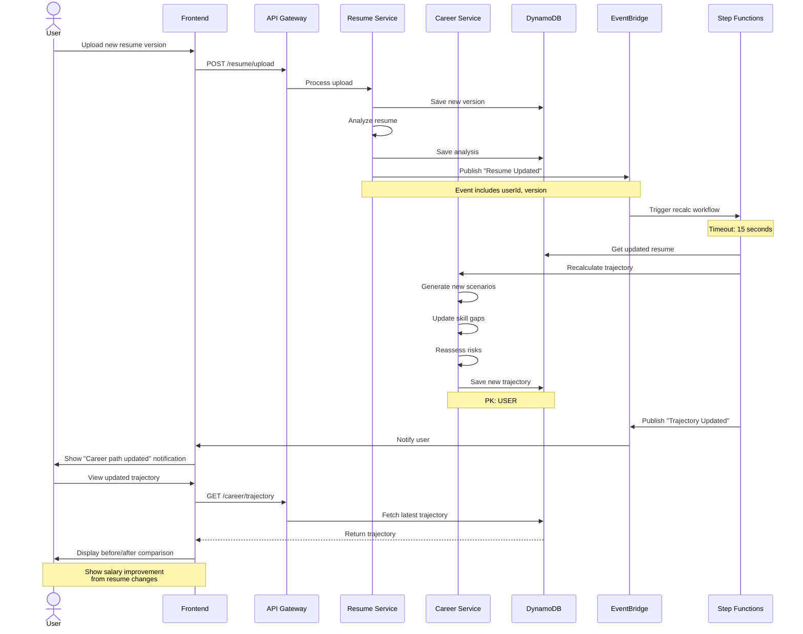

---

## Responsive Design Breakpoints

### Mobile (375px - 767px)

**Validates:** REQ-NFR-032

```
┌─────────────────────┐
│  ☰  FutureForge  🔔 │  ← Hamburger menu
├─────────────────────┤
│                     │
│  Career Trajectory  │  ← Stacked cards
│  ┌─────────────────┐│
│  │ ₹18 LPA (Yr 5) ││
│  │ ●●●●●●●○○○      ││
│  └─────────────────┘│
│                     │
│  Skill Gaps         │
│  ┌─────────────────┐│
│  │ 1. System Design││
│  │    Impact: 95   ││
│  └─────────────────┘│
│                     │
│  Today's Tasks      │
│  ┌─────────────────┐│
│  │ ☐ Task 1        ││
│  │ ☐ Task 2        ││
│  └─────────────────┘│
│                     │
└─────────────────────┘
```

### Tablet (768px - 1023px)

```
┌─────────────────────────────────────┐
│  ☰  FutureForge        🔔  Profile  │
├─────────────────────────────────────┤
│                                     │
│  ┌───────────────┐ ┌──────────────┐│
│  │  Trajectory   │ │  Skill Gaps  ││
│  │  Chart        │ │  List        ││
│  └───────────────┘ └──────────────┘│
│                                     │
│  ┌─────────────────────────────────┐│
│  │  Today's Tasks (Full Width)     ││
│  └─────────────────────────────────┘│
│                                     │
└─────────────────────────────────────┘
```

### Desktop (1024px+)

```
┌─────────────────────────────────────────────────────────┐
│  Logo  Search          Notifications  Profile           │
├───┬─────────────────────────────────────────────────────┤
│ N │  Career Trajectory    │  Skill Gaps  │  Burnout    │
│ a │  ┌──────────────────┐ │ ┌──────────┐ │ ┌─────────┐│
│ v │  │  Chart           │ │ │  List    │ │ │  Meter  ││
│   │  └──────────────────┘ │ └──────────┘ │ └─────────┘│
│ M │                        │              │             │
│ e │  Today's Tasks         │  Progress    │  Resources  │
│ n │  ┌──────────────────┐ │ ┌──────────┐ │ ┌─────────┐│
│ u │  │  Task List       │ │ │  Charts  │ │ │  Links  ││
│   │  └──────────────────┘ │ └──────────┘ │ └─────────┘│
└───┴─────────────────────────────────────────────────────┘
```

---

## Accessibility Features

### Keyboard Navigation

**Validates:** REQ-NFR-034

| Key | Action |
|-----|--------|
| `Tab` | Navigate to next interactive element |
| `Shift + Tab` | Navigate to previous element |
| `Enter` / `Space` | Activate button or link |
| `Esc` | Close modal or dialog |
| `Arrow Keys` | Navigate within lists or charts |
| `Ctrl + /` | Open keyboard shortcuts help |

### Screen Reader Support

**Validates:** REQ-NFR-035, REQ-NFR-037

- All images have `alt` text
- Charts have text descriptions
- Form inputs have associated labels
- ARIA landmarks for page regions
- ARIA live regions for dynamic updates
- Skip to main content link

### Color Contrast

**Validates:** REQ-NFR-036

- Text: 4.5:1 minimum contrast ratio
- Large text (18pt+): 3:1 minimum
- Interactive elements: 3:1 minimum
- Focus indicators: 3:1 minimum

---

## Component Library

### Buttons

```
Primary:   [Generate Career Path]  ← Blue, bold
Secondary: [View Details]          ← Gray outline
Danger:    [Delete Account]        ← Red
Success:   [Mark Complete]         ← Green
Disabled:  [Loading...]            ← Gray, no hover
```

### Cards

```
┌─────────────────────────────────┐
│  Card Title              [Icon] │
├─────────────────────────────────┤
│                                 │
│  Card content goes here         │
│  with proper spacing            │
│                                 │
│  [Action Button]                │
└─────────────────────────────────┘
```

### Badges

```
Status:  ✓ Complete  ⚠️ Warning  ❌ Error  🔄 In Progress
Priority: [P0] [P1] [P2]
Difficulty: 🟢 Easy  🟡 Medium  🔴 Hard
```

### Progress Bars

```
Linear:  ████████████░░░░░░░░  60%
Circular: ◐ 75%
Gauge:   ├────●────────────┤  25%
```

---

## Design Tokens

### Spacing Scale

```
xs:  4px
sm:  8px
md:  16px
lg:  24px
xl:  32px
2xl: 48px
3xl: 64px
```

### Border Radius

```
sm: 4px   (buttons, badges)
md: 8px   (cards, inputs)
lg: 12px  (modals, panels)
xl: 16px  (hero sections)
```

### Shadows

```
sm: 0 1px 2px rgba(0,0,0,0.05)
md: 0 4px 6px rgba(0,0,0,0.1)
lg: 0 10px 15px rgba(0,0,0,0.1)
xl: 0 20px 25px rgba(0,0,0,0.15)
```

---

## Animation Guidelines

### Transitions

- Duration: 150ms (fast), 300ms (normal), 500ms (slow)
- Easing: ease-in-out for most, ease-out for entrances
- Properties: opacity, transform, color

### Loading States

- Skeleton screens for content loading
- Spinner for actions (< 2s expected)
- Progress bar for long operations (> 2s)

### Micro-interactions

- Button press: scale(0.98)
- Hover: slight elevation increase
- Success: checkmark animation
- Error: shake animation

---

**Document Version:** 1.0  
**Last Updated:** February 14, 2026  
**Status:** Ready for Development  
**Target:** Amazon AI for Bharat Hackathon

*End of Wireframes Document*
